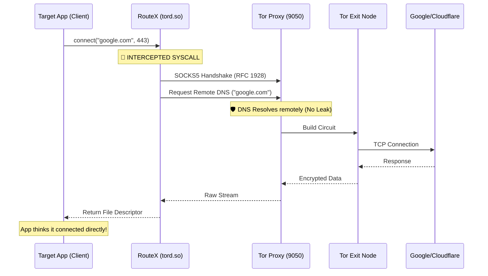

# RouteX: Transparent Tor Interceptor


**RouteX** is a systems-level intercepting proxy built in C that forces TCP connections through the Tor network without application support.

It uses dynamic linker hijacking (`LD_PRELOAD` on Linux / `DYLD_INSERT_LIBRARIES` on macOS) to hook system calls, transparently wrapping standard TCP sockets into an anonymous SOCKS5 tunnel with **Remote DNS** resolution and **OpenSSL** encryption.

---

## 🛠 Architecture

RouteX does not require the target application to support proxies. It injects itself between the application and the Kernel using a shared library.



---

## Key Features

- **System Call Interception:** Hooks connect() using dlsym and RTLD_NEXT to override OS networking behavior.
- **Custom SOCKS5 Implementation:** A lightweight, dependency-free implementation of the SOCKS5 Protocol (RFC 1928).
- **Remote DNS (No Leaks):** Implements SOCKS5 ATYP 0x03 (Domainname) to resolve hostnames at the Tor Exit Node, preventing ISP DNS leaks.
- **SSL/TLS Support:** Wraps the anonymous tunnel in OpenSSL to support HTTPS (TLS_AES_256_GCM_SHA384), enabling secure access to modern web services.
- **Cross-Platform:** Supports macOS (via dyld) and Linux (via ld-linux).


## Installation & Build
Prerequisites
- GCC (Compiler)
- Tor (Must be running on port 9050)
- OpenSSL (For HTTPS support)

macOS (Homebrew):
```
brew install tor openssl
brew services start tor
```

Linux (Debian/Ubuntu):
```
sudo apt install tor libssl-dev build-essential
sudo systemctl start tor
```

Compile:

The project includes a Makefile for automated building.
```
make
```

- ```tord.so```: The shared library that performs the interception.
- ```client_ssl```: A custom HTTPS client for testing the tunnel.

## Usage
1. The Wrapper Script (Recommended):

Use the included routex script to automatically handle library injection and environment variables.
```
# Usage: ./routex <hostname>
./routex www.google.com
```

2. Manual Injection (Power User):

You can inject RouteX into any compatible CLI tool or script by manually setting the environment variables.
on MacOS:
```
export ROUTEX_HOSTNAME="eth0.me"
export DYLD_INSERT_LIBRARIES=$(pwd)/tord.so
export DYLD_FORCE_FLAT_NAMESPACE=1

./client_ssl eth0.me 443
```

on Linux:
```
export ROUTEX_HOSTNAME="eth0.me"
export LD_PRELOAD=$(pwd)/tord.so

./client_ssl eth0.me 443
```

## Technical Deep Dive
1. The Hook (tord.c)
RouteX defines a function named connect that matches the signature of the standard POSIX system call. When loaded into memory before libc, the dynamic linker links the application's call to our function.

We then pause the execution, establish a side-channel to the local Tor SOCKS proxy (127.0.0.1:9050), and perform the handshake before handing control back to the application.

2. The Protocol (SOCKS5)
We manually construct raw bytes to speak SOCKS5:

- **Handshake:** 0x05 0x01 0x00 (Version 5, 1 Auth Method, No Auth).
- **Request:** 0x05 0x01 0x00 0x03 <Len> <Hostname> <Port>

Note: The 0x03 byte is critical. It tells Tor "Do not ask my computer's DNS server for the IP. You figure it out." This closes the DNS leak vulnerability.

3. The Encryption (OpenSSL)
Once the SOCKS tunnel is established, we treat the socket as a standard file descriptor and hand it off to SSL_set_fd(). This layers a TLS handshake inside the Tor tunnel, ensuring end-to-end encryption to the destination.

## ⚠️ Disclaimer
This tool is for educational purposes and security research only. Ujjwal Sharma is not responsible for any misuse of this software.
